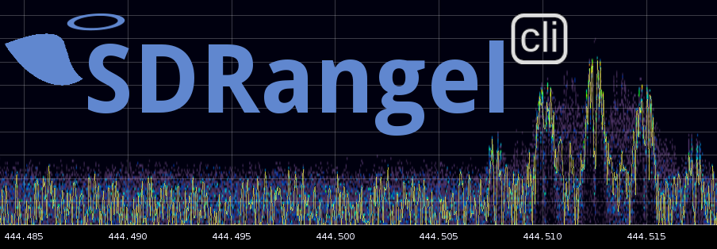

# Introduction

**&#9888; WARNING: this is a work in progress**

This is a browser based web client for [SDRangel SDR software](https://github.com/f4exb/sdrangel) Please click on the link to get more information.

You may also ask questions about SDRangel or this web application in the [SDRangel group](https://groups.io/g/sdrangel) in groups.io

SDRangel is a Software Defined Radio (SDR) application that processes the digital samples produced by various SDR front end devices (RTL-SDR, LimeSDR, ...) using software running on commodity computers to implement radio processing functions that used to be handled by hardware e.g AM, FM demodulation... SDRangel is also capable of driving SDR transmitters in a reversed flow: it produces digital samples that are sent to a SDR transmitter (LimeSDR, HackRF...) to eventually produce a RF signal.

This web application communicates with a SDRangel running instance (GUI based or headless) using its HTTP REST API. It is written based on Angular 8.2 (see development section for more details).

It can be used to remotely control a GUI based version of SDRangel and also serve as a UI for the headless version. Most of the functions can be accessed using this web interface.

# Prerequisites

## Step 1. Node & Git

* Make sure you have [Git](https://www.git-scm.com) installed
* Make sure you have [NodeJS 12](https://nodejs.org/) or later installed on your machine
* Make sure you have npm (Node Package Manager, comes bundled with NodeJS) at least version 6

You can check whether you already have them and your current versions by executing

```bash
git --version
node --version
npm --version
```

### Install node JS and NPM:

#### Arch:
```bash
sudo pacman -S nodejs npm
```

#### Debian/Raspbian/Ubuntu:
```bash
sudo apt-get install nodejs npm
```

#### OpenSUSE:
```bash
sudo zypper in nodejs npm
```

### If you need to use multiple node versions on your machine consider using:

* [nvm](https://github.com/creationix/nvm) (OSX, Linux)
* [nodist](https://github.com/marcelklehr/nodist) (Win)
* [nvm-windows](https://github.com/coreybutler/nvm-windows) (Win)

### You might want update the `npm` to the latest version by doing:

```bash
sudo npm install npm -g
```

## Step 2. Clone the repository and set up environment

```bash
# clone → it will create the directory named 'sdrangelcli' in the current one
git clone https://github.com/f4exb/sdrangelcli

# install global dependencies
sudo npm install -g @angular/cli@8

# install local dependencies
cd sdrangelcli
npm install

# check that everything is working by running the following and opening http://localhost:4200 in your browser afterwards
npm start
```
Be patient `npm install` can be very long depending on your hardware.

# Build and serve

## Build

```bash
# build
cd sdrangelcli
ng build

# This will create a dist/sdrangelcli directory that will contain the application
# You can copy or move sdrangelcli directory wherever you like

```

## Serve directly

```bash
# Install a simple node.js server
sudo npm install http-server -g

# in the dist/sdrangelcli directory do
http-server

# By default http-server listens on all available network interfaces on port 8080.
# This can be changed with the options:
#   -p <port>
#   -a <address> This is the address of the network interface on the server

```

## Serve with supervisord

We will not cover supervisord setup and jump into the creation of a `.conf` file for `sdrangelcli`.

Assumptions:
  - the distribution is installed in `/opt/build/sdrangelcli/dist/sdrangelcli`
  - the network interface address is `192.168.2.1` and port `8001` will be used
  - the user name is `f4exb`

You may adapt it to your own needs.

Create a `/etc/supervisor.d/sdrangelcli.conf` with this content:

```bash
[program:sdrangelcli]
directory = /opt/build/sdrangelcli/dist/sdrangelcli
command = http-server -a 192.168.2.1 -p 8001
process_name = sdrangelcli
user = f4exb
stopsignal = INT
autostart = false
autorestart = false
environment =
    USER=f4exb,
    PATH="/usr/local/sbin:/usr/local/bin:/usr/bin:/usr/bin/site_perl:/usr/bin/vendor_perl:/usr/bin/core_perl",
    HOME="/home/f4exb"
redirect_stderr = true
stdout_logfile = /home/f4exb/log/sdrangelcli.log
stdout_logfile_maxbytes = 10MB
stdout_logfile_backups = 3
loglevel = debug
```

In `/etc/supervisord.conf` add `/etc/supervisor.d/sdrangelcli.conf` to the list of processes controlled by `supervisord`:

```bash
...
[include]
files = /etc/supervisor.d/sdrangelsrv.conf /etc/supervisor.d/sdrangelcli.conf
```

Reload supervisord configuration with `sudo systemctl reload supervisord`

# Development

## Prerequisites

### Step 1. Configure your IDE

We'll be wring code using TypeScript and Angular, so it would be nice to have at least code highlighting and autocompletion.
We recommend using:

* [Visual Studio Code (free)](https://code.visualstudio.com/Download) - After the installation, run the IDE and make sure the recommended extensions are installed as described in this [guide](https://code.visualstudio.com/docs/editor/extension-gallery#_workspace-recommended-extensions). All extensions are listed under `.vscode/extension.json` and can be viewed in the UI using "Show workspace recommended extensions" filter.

### Step 2. Install Angular Augury plugin

If you're using Chrome it might be a good idea to install the [Augury Plugin](https://augury.angular.io) that will help debugging Angular applications

## Sdrangelcli

This project was generated with [Angular CLI](https://github.com/angular/angular-cli) version 8.2.

### Development server

Run `ng serve` for a dev server. Navigate to `http://localhost:4200/`. The app will automatically reload if you change any of the source files.

### Code scaffolding

Run `ng generate component component-name` to generate a new component. You can also use `ng generate directive|pipe|service|class|guard|interface|enum|module`.

### Build

Run `ng build` to build the project. The build artifacts will be stored in the `dist/` directory. Use the `--prod` flag for a production build.

### Running unit tests

Run `ng test` or `npm test` to execute the unit tests via [Karma](https://karma-runner.github.io). This is good for TDD as the tests run continuously whenever the code changes on disk.

### Running end-to-end tests

Run `ng e2e` to execute the end-to-end tests via [Protractor](http://www.protractortest.org/).

### Further help

To get more help on the Angular CLI use `ng help` or go check out the [Angular CLI README](https://github.com/angular/angular-cli/blob/master/README.md).
